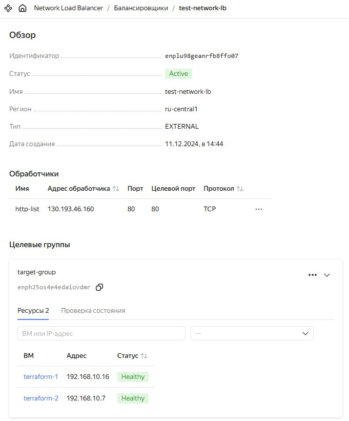
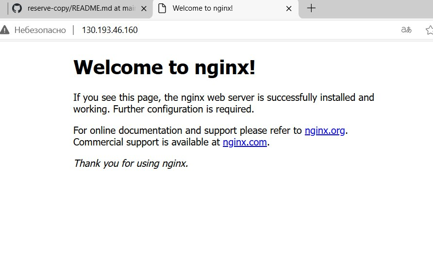

# Домашнее задание к занятию "`Отказоустойчивость в облаке`" - `Nikonov Danila`


### Задание 1

**terraform playbook. main.tf**

```
terraform {
  required_providers {
    yandex = {
        source = "yandex-cloud/yandex"
    }
  }  
}

variable "yandex_cloud_token" {
  type = string
  description = "OAuth-token"
}

provider "yandex" {
  token = var.yandex_cloud_token
  cloud_id = "b1g4mjog84lvq7ff3qjg"
  folder_id = "b1gn2i4hhslqsuta1jco"
  zone = "ru-central1-a"
}

resource "yandex_vpc_network" "network-1" {
  name = "network1"
}

resource "yandex_vpc_subnet" "subnet-1" {
  name = "subnet1"
  zone = "ru-central1-a"
  network_id = yandex_vpc_network.network-1.id
  v4_cidr_blocks = ["192.168.10.0/24"]
}

resource "yandex_compute_disk" "boot-disk" {
  count = 2
  name = "boot-disk-${count.index + 1}"
  type = "network-hdd"
  zone = "ru-central1-a"
  size = "20"
  image_id = "fd8k2ed4jspu35gfde1u"
}

resource "yandex_compute_instance" "terraform-1" {
  count = 2

  name = "terraform-${count.index + 1}"

  resources {
    cores = 2
    memory = 2
  }

  boot_disk {
    disk_id = yandex_compute_disk.boot-disk[count.index].id
  }

  metadata = {
    ssh-keys = "ubuntu:${file("~/.ssh/id_rsa.pub")}"
  }
  
  network_interface {
    subnet_id = yandex_vpc_subnet.subnet-1.id
    nat = true
  }
}

resource "yandex_lb_target_group" "target_group" {
  name      = "target-group"
  folder_id = "b1gn2i4hhslqsuta1jco"  

  target {
    address   = yandex_compute_instance.terraform-1[0].network_interface[0].ip_address
    subnet_id = yandex_vpc_subnet.subnet-1.id
  }

  target {
    address   = yandex_compute_instance.terraform-1[1].network_interface[0].ip_address
    subnet_id = yandex_vpc_subnet.subnet-1.id
  }
}

resource "yandex_lb_network_load_balancer" "lb" {
  name      = "test-network-lb"
  folder_id = "b1gn2i4hhslqsuta1jco"

  listener {
    name        = "http-list"
    port        = 80
    target_port = 80
    protocol    = "tcp" 
  }

  attached_target_group {
    target_group_id = yandex_lb_target_group.target_group.id

    healthcheck {
      name                   = "http-health"
      interval               = 10
      timeout                = 5
      unhealthy_threshold    = 2
      healthy_threshold      = 2

      http_options {
        port = 80
        path = "/"
      }
    }
  }
}

```

**target-group**



**Скриншот страницы, которая открылась при запросе IP-адреса балансировщика.**


